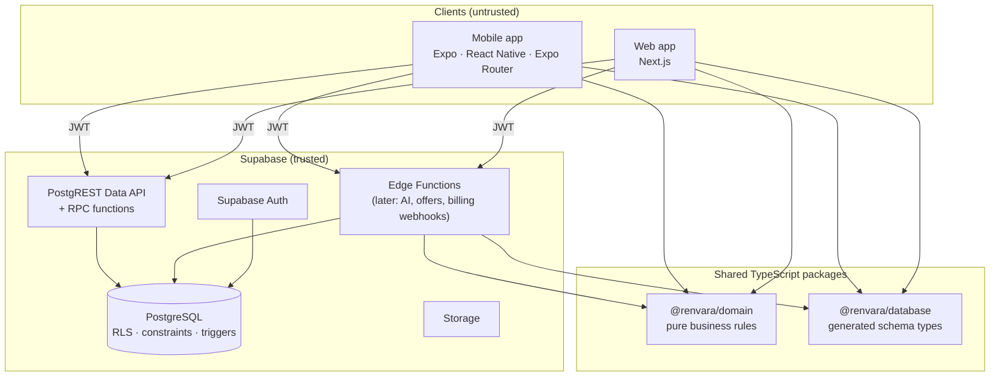

# 1. System overview

## Shape of the system



Mobile and web share one backend: the same database, auth, organizations,
permissions and data. Nothing is client-specific on the server.

## Where business logic lives

Each rule lives in exactly one authoritative place, chosen by what it protects.

| Tier | Lives in | Responsible for | Examples |
|---|---|---|---|
| **1. Database** | `supabase/migrations` | Invariants that must hold no matter who writes: any client, an AI tool call, an import or a bug. | Tenant isolation (RLS), cross-tenant FK safety, `closed_at` ⇔ status, last-owner protection, authorship stamping, system timeline entries |
| **2. Domain** | `packages/domain` | Deterministic rules and calculations with no I/O. Shared by mobile, web and edge functions, and unit-tested. | Opportunity transitions, next-action selection, attention reasons, due/overdue in the user's timezone, role → permission map |
| **3. Application services** | Later: `packages/services` / Edge Functions | Use cases that orchestrate I/O. | "Log a call and schedule a follow-up", AI tool handlers, invitations, offer tracking |
| **4. UI** | `apps/*` | Presentation only. | Never decides authorization; may *hide* actions using `can()` |

Rules that exist in two tiers have a test on each side. For example, next-action
ordering is implemented in the SQL view and in `selectNextAction()`. The
database is authoritative for **what is allowed**. The domain is authoritative
for **what something means**: overdue, needs attention, allowed transitions.

## Packages

```
apps/                     (reserved: mobile, web; added in later phases)
packages/
  domain/                 @renvara/domain: framework-free rules, zero runtime deps
  database/               @renvara/database: generated types plus the enum contract
supabase/
  migrations/             ordered SQL migrations (the schema's source of truth)
  tests/database/         pgTAP tests (RLS, invariants)
docs/                     architecture, ADRs, open questions
```

Dependency direction is strictly one-way:
`apps → services → domain`. `database` only supplies types. `domain` imports nothing.

## Thin clients

* Clients talk to PostgREST with the user's JWT. RLS decides what they see.
* Multi-step writes that must be atomic go through RPC functions (Postgres) or
  Edge Functions, never through a sequence of client calls. An example is
  `create_organization`.
* The `service_role` key never ships in a client. It is used only by Edge
  Functions and back-office jobs.

## Provider-independent seams (designed now, built later)

**AI.** Domain and services depend on an `AIProvider` port, never on a vendor SDK:

```ts
interface AIProvider {
  complete(request: AICompletionRequest): Promise<AICompletionResult>; // incl. tool calls
}
// adapters: ClaudeProvider, OpenAIProvider, …, selected by configuration
```

AI output reaches the data model only through the same application services
humans use, for example `logActivity` and `scheduleTask`. It never writes
directly to the database. Records created this way carry
`source = 'ai_assistant'`, so they are auditable and filterable.

**Billing.** A provider-neutral billing module will own `plans`,
`subscriptions` and entitlements. Stripe, Apple and Google Play become adapters
that translate webhooks into these tables. Business code asks "is feature X
enabled / how many seats" and never asks Stripe. See ADR-0007.

## Scaling notes

* Every tenant table leads its indexes with `organization_id` or a selective FK.
  RLS membership checks run once per statement (InitPlan or hashed subplan),
  not per row.
* UUIDv7 keys keep B-tree inserts append-mostly.
* Derived values such as next action and last activity are computed by indexed
  lookups. They can later be cached behind the same view without any client
  change (ADR-0005).
* Nothing assumes a single organization per user.
