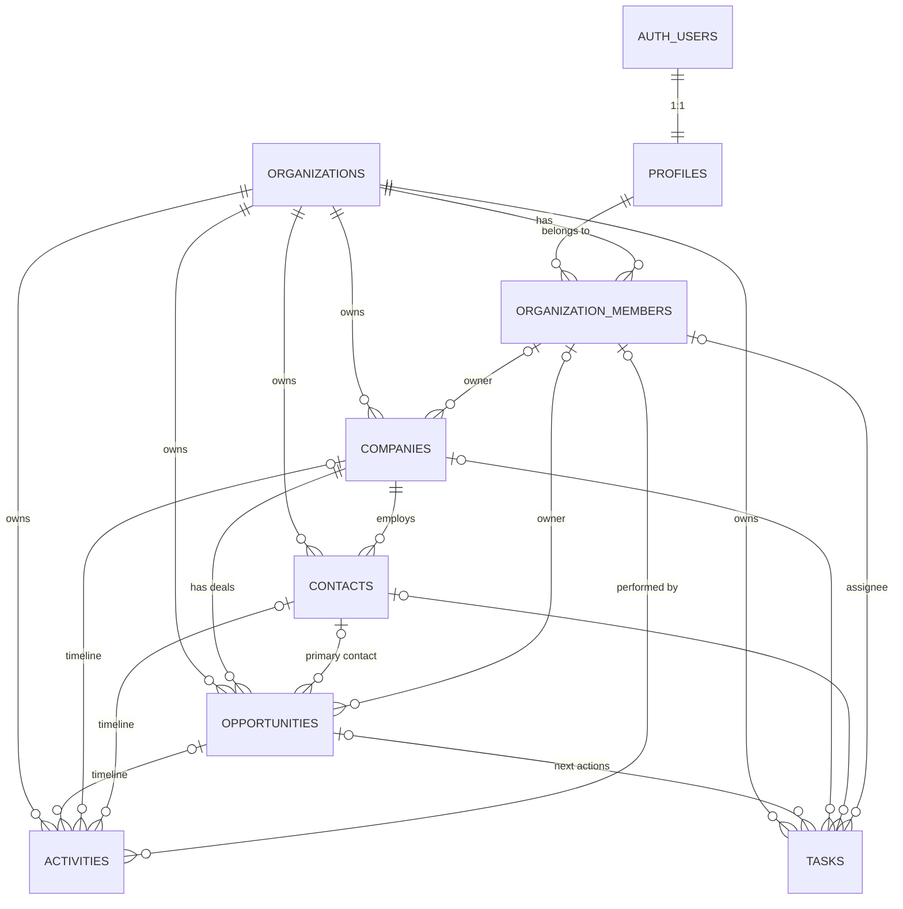

# 2. Domain model

## Entity relationship overview (Phase 1, implemented)



All references between tenant tables are composite `(organization_id, x_id)`
foreign keys. References to people point at `organization_members`, so an owner
or assignee is always a member of the same organization (ADR-0002).

## Entities

### Organization (tenant)
The root of all business data. It holds identity and defaults: name, legal
name, country, timezone, default currency, locale and tax ID. Billing, plan and
seat data are deliberately **not** columns here; they belong to the billing
module (ADR-0007). Organizations are created only through the
`create_organization()` RPC, which makes the caller the owner atomically.

### Profile (user)
One row per `auth.users` row, created by trigger. It holds no credentials. It
carries `timezone`, which drives "today" and "overdue" for that user, plus
`locale` and a read-only mirror of `email`.

### OrganizationMember
Junction of user and organization with `role` (owner, admin, manager or sales)
and `status` (active, suspended or removed). Improvements over the initial sketch:

* `unique (organization_id, user_id)` is the target of composite FKs, so
  ownership and assignment are guaranteed to stay inside the tenant.
* **No `invited` status.** An invitation targets an *email* that may have no
  account yet. It will be a separate `organization_invitations` table. A
  membership row exists only for real users.
* Removal is a status change, never a delete, so historical owners and authors
  stay resolvable. Rows are hard-deleted only when the user account is deleted
  (GDPR), and the references then become `NULL`.
* `status_changed_at` is kept for seat accounting and audits.
* Invariants (trigger): only owners grant or revoke ownership, nobody changes
  their own role or status, and an organization always keeps at least one
  active owner.

### Company
A customer or prospect account. `customer_status` (prospect, active_customer or
inactive_customer) describes the **relationship** and is independent from any
deal. A company can have many opportunities over time. `archived_at` hides it
from working lists without losing history.

### Contact
A person. `company_id` is nullable, so a person can be captured before their
company is known, which voice capture will need. At most one non-archived
primary contact per company is enforced by a partial unique index. A future
many-to-many contact-company role table can be added without changing contact
identity.

### Opportunity
A deal with exactly one company. It has two orthogonal dimensions (ADR-0003):

| field | values | meaning |
|---|---|---|
| `stage` | new_lead → contacted → qualified → proposal → negotiation | pipeline position, retained after closing |
| `status` | active · won · lost | outcome |

`closed_at` replaces separate `won_at` and `lost_at` columns. Combined with
`status` it carries the same information and cannot contradict itself. The DB
enforces `status = active ⇔ closed_at IS NULL` and allows `lost_reason` only
when lost. `expected_close_date` is a `date`, not a timestamp.

Probability (`manual_probability` 0–100) and `interest_level` are explicit
manual inputs. Computed scores such as engagement or AI intent will be separate
derived values, never overwriting manual ones.

### Activity: "what happened"
A historical fact: call, email, meeting, note, offer sent, follow-up, status
change or other. It must reference at least one of company, contact or
opportunity. The company is derived automatically from the opportunity, or else
from the contact, so a company timeline is a single indexed query. `occurred_at`
(when it happened, may be back-dated) is distinct from `created_at` (when it
was recorded). `source` records who created it: manual, system, ai_assistant,
import or integration.

Stage and status changes are written to the timeline automatically
(`source = system`, details in `metadata`). Clients cannot forge system entries.

**Metadata policy:** relational columns hold everything you filter, join or
aggregate on. `metadata jsonb` holds type-specific details only, such as call
duration, an email message ID or from/to stage. It must be a JSON object of at
most 16 KB. If a metadata key starts being queried, it gets promoted to a
column (ADR-0005).

### Task: "what needs to happen"
A future obligation with an assignee, type, priority and status
(open, completed or cancelled). `closed_at` is stamped automatically. Due is one of:

* `due_date` (date): "by Friday", evaluated in the assignee's timezone;
* `due_at` (timestamptz): "call at 14:00", an exact instant;
* neither: undated.

The two are mutually exclusive (CHECK). Tasks may have no subject at all,
which allows personal reminders.

## The next-action rule (ADR-0004)

> No active sales opportunity should exist without a known next action.

**Decision: derived (option C, hybrid).** The next action of an opportunity is
its **earliest open task**. Nothing is stored on the opportunity row.

```
needs_next_action = status = 'active' AND no open task linked to the opportunity
```

* `public.opportunity_overview` (a security-invoker view) exposes
  `next_task_*`, `last_activity_at` and `needs_next_action` for every
  opportunity. This is the read model for pipeline lists and the future
  "needs attention" metric.
* `@renvara/domain` provides `selectNextAction()` with identical ordering and
  `attentionReasons()`, which returns `missing_next_action` or
  `next_action_overdue`, evaluated in the viewer's timezone.
* Completing the next task automatically promotes the following one, and if
  none remains, the opportunity surfaces as needing attention. No
  synchronization code is needed.

"Wait for response" is a valid next action. See the waiting proposal below.

## Mapping the AI example onto the model

> "I spoke with Mark. He will check the offer with management and get back to me by Friday."

| Extracted meaning | Stored as |
|---|---|
| a call happened | `activities` type `phone_call`, `source = ai_assistant`, contact = Mark (company derived) |
| what was agreed | the activity's `description` |
| opportunity identified | the activity's `opportunity_id` |
| waiting until Friday, then follow up | `tasks` type `follow_up`, `due_date` = Friday, linked to the opportunity, which becomes its next action |

No schema change is required for this flow. The AI layer needs only entity
resolution (finding "Mark") and the application services.

## Future entities: analysis and recommendation

| Proposed | Recommendation | Why |
|---|---|---|
| **FollowUp** | **Not a separate entity.** It is a `task` with `type = follow_up`. | A follow-up is something the user must do at a time. A second "future action" table would split the next-action rule in two. |
| **WaitingItem** | **Model as task state, not an entity.** *Proposal, needs approval:* add a task type `await_response` (or a `waiting_since` column) whose due date is the expected-response date. When it passes, the task is overdue and becomes the follow-up prompt. | Waiting is "the next action is the customer's". Keeping it in tasks keeps one source of truth for next actions and makes "how long have I been waiting" a simple derived value. |
| **Offer** | **Entity** (`offers`): belongs to an opportunity, has a document in Storage, a public share token, sent_at and status. | It has its own identity, lifecycle and external link. It is not a pricing engine: no line items or calculations. |
| **OfferView** | **Entity, append-only event** (`offer_views`), written by an Edge Function when the share link is opened. | High-volume telemetry. Engagement scores are derived from it. Significant views can also produce an `offer_viewed` activity on the timeline. |
| **Notification** | **Entity as a delivery log** (`notifications`). What *should* notify is derived from tasks and events; the table records what was sent, to whom, on which channel and when it was read. | Reminders are derived from task due values, so there is nothing to keep in sync. The log gives idempotency and read state. |
| **AIConversation / AIMessage** | **Entities**, user-private by default (RLS on `user_id` as well as organization). | Needed for context, audit and cost tracking. Message content is not CRM data. |
| **AINote** | **Not an entity.** It is an `activity` (`type = note`, `source = ai_assistant`). | One timeline. Provenance is captured by `source` and the linked conversation ID in `metadata`. |
| **Plan / Subscription** | **Entities in a billing module**, provider-neutral, with a `provider` and `external_id` per subscription. | Keeps Stripe, Apple and Google behind adapters (ADR-0007). |
| **Seat** | **Derived**, not an entity: seats used = active memberships, and the seat limit comes from the subscription's entitlements. | Avoids a second list of "who has access" that could disagree with memberships. |
| **AuditEvent** | **Entity, append-only** (`audit_events`), written by triggers or services for security-relevant changes: membership and role changes, deletes, exports. | Phase 1 already stamps `created_by` and `updated_by` and writes status-change activities. A full audit trail is a separate concern from the user-facing timeline. |
